<h1 align="center" style="border-bottom: none">
    <a href="https://signoz.io" target="_blank">
        
    </a>
    <br>Foundry
</h1>

<p align="center">

  <a href="https://golang.org"></a>

<p align="center">Foundry is a centralized hub for <a href="https://signoz.io">SigNoz</a> installation configurations and deployments: <strong>integrations for install</strong>. Select yours, configure, and run SigNoz.</p>

## Overview

Just as a metalworking foundry turns raw materials into finished products, Foundry forges your deployment from a single configuration and casts SigNoz to fit your environment.

Foundry abstracts away the complexities of the installation process so you can spend time *using* SigNoz rather than *installing* it.

<p align="center">
  
</p>

## Features

- **Multi-platform support**: Deploy SigNoz using Docker Compose, Systemd (bare metal), or Render for flexible installation across environments.
- **Single configuration file**: Configure your entire SigNoz stack with one concise file.
- **Automatic dependency management**: Handles inter-service dependencies
- **Tool validation**: Verify prerequisites before deployment

## Quick start

**1. Install foundryctl**

Download a release from [GitHub Releases](https://github.com/signoz/foundry/releases), or use the command line:

```bash
# Linux
curl -L "https://github.com/SigNoz/foundry/releases/latest/download/foundry_linux_$(uname -m | sed 's/x86_64/amd64/g' | sed 's/aarch64/arm64/g').tar.gz" -o foundry.tar.gz
tar -xzf foundry.tar.gz

# macOS
curl -L "https://github.com/SigNoz/foundry/releases/latest/download/foundry_darwin_$(uname -m | sed 's/x86_64/amd64/g' | sed 's/arm64/arm64/g').tar.gz" -o foundry.tar.gz
tar -xzf foundry.tar.gz
```

See [Getting Started](docs/getting-started.md) for full install instructions (including Windows) and a step-by-step walkthrough.

**2. Create a casting**

```yaml
apiVersion: v1alpha1
metadata:
  name: signoz
spec:
  deployment:
    mode: docker
    flavor: compose
```

**3. Deploy**

```bash
foundryctl cast -f casting.yaml
```

## The Foundry Model

Foundry uses a metalworking metaphor: you define a **Casting**, which contains **Moldings** (components), and Foundry **forges** them into **Pours** (generated files).

```mermaid
graph LR
    A[📋 casting.yaml<br/>Single Config File] --> B[🔧 foundryctl gauge<br/>Validate Tools]
    B --> C[⚒️ foundryctl forge<br/>Generate Deployment Files]
    C --> D[🏺 pours/<br/>compose.yaml + configs]

    D --> E[🔥 foundryctl cast<br/>Deploy]
    E --> F[⚙️ Docker Compose /<br/>Systemd /<br/>Cloud Platform]
    F --> G[✨ SigNoz Running<br/>ClickHouse, PostgreSQL,<br/>OTel Collector, SigNoz UI]

    style A fill:#FF9900,stroke:#E68A00,stroke-width:3px,color:#000
    style D fill:#FDB44B,stroke:#E68A00,stroke-width:3px,color:#000
    style G fill:#4E9FFF,stroke:#2A7FD8,stroke-width:3px,color:#fff
    style B fill:#1F1F1F,stroke:#FF9900,stroke-width:2px,color:#fff
    style C fill:#1F1F1F,stroke:#FF9900,stroke-width:2px,color:#fff
    style E fill:#1F1F1F,stroke:#FF9900,stroke-width:2px,color:#fff
    style F fill:#2D2D2D,stroke:#4E9FFF,stroke-width:2px,color:#fff
```


### Casting

A Casting is a complete SigNoz deployment definition: one YAML file that Foundry merges with built-in defaults. See [What is a Casting](docs/concepts/casting.md) for the full explanation, or [Casting File Reference](docs/reference/casting-file.md) for the field-by-field spec.

### Examples

| Deployment | Path |
|---|---|
| Docker Compose | [docker/compose](docs/examples/docker/compose/) |
| Docker Swarm | [docker/swarm](docs/examples/docker/swarm/) |
| Systemd (binary) | [systemd/binary](docs/examples/systemd/binary/) |
| Kubernetes (Kustomize) | [kubernetes/kustomize](docs/examples/kubernetes/kustomize/) |
| Kubernetes (Kustomize + patches) | [kubernetes/kustomize-patches](docs/examples/kubernetes/kustomize-patches/) |
| Kubernetes (Helm) | [kubernetes/helm](docs/examples/kubernetes/helm/) |
| Kubernetes (Helm + patches) | [kubernetes/helm-patches](docs/examples/kubernetes/helm-patches/) |
| Render Blueprint | [render/blueprint](docs/examples/render/blueprint/) |
| Coolify Stack | [coolify/stack](docs/examples/coolify/stack/) |
| Railway Template | [railway/template](docs/examples/railway/template/) |
| AWS ECS (EC2 + Terraform) | [ecs/ec2/terraform](docs/examples/ecs/ec2/terraform/) |

See [Examples](docs/examples/) for the full index with descriptions.

### Moldings

**Moldings** are the individual components that make up a SigNoz deployment:

| Molding | Implementation |
|---------|----------------|
| **TelemetryStore** | ClickHouse |
| **TelemetryKeeper** | ClickHouse Keeper |
| **MetaStore** | PostgreSQL, SQLite |
| **Ingester** | SigNoz OTel Collector |
| **SigNoz** | SigNoz |

See [Moldings](docs/concepts/moldings.md) for processing order, spec fields, and configuration details.

### Pours

**Pours** are the generated deployment and configuration files. `forge` creates the `pours/` directory containing everything needed to run SigNoz. The structure varies by deployment mode - see each [example](docs/examples/) for its generated output.

## CLI reference

```
foundryctl [command]

Commands:
  gauge       Validate required tools for your deployment mode
  forge       Generate deployment and configuration files
  cast        Full pipeline: gauge + forge + deploy
  gen         Generate example casting files for all modes

Flags:
  -d, --debug          Enable debug logging
  -f, --file string    Casting file path (default "casting.yaml")
  -p, --pours string   Output directory (default "./pours")
```

```bash
# Validate tools
foundryctl gauge -f casting.yaml

# Generate files only
foundryctl forge -f casting.yaml

# Full deploy
foundryctl cast -f casting.yaml

# Generate examples for all deployment modes
foundryctl gen
```

See [CLI Reference](docs/reference/cli.md) for the full command reference with all flags and examples.

## What's next

- [Getting Started](docs/getting-started.md) - install and deploy your first SigNoz instance
- [Concepts](docs/concepts/) - understand castings, moldings, and patches
- [Examples](docs/examples/) - deployment configurations for all supported platforms
- [Reference](docs/reference/) - CLI commands and casting file spec
- [SigNoz documentation](https://signoz.io/docs/) - learn more about SigNoz
- [SigNoz Slack](https://signoz.io/slack) - community and support

## How can I get help?

- **Issues**: [GitHub Issues](https://github.com/signoz/foundry/issues)
- **Documentation**: [SigNoz Docs](https://signoz.io/docs/)
- **Community**: [SigNoz Slack](https://signoz.io/slack)

**Made with ❤️ for the SigNoz community**
